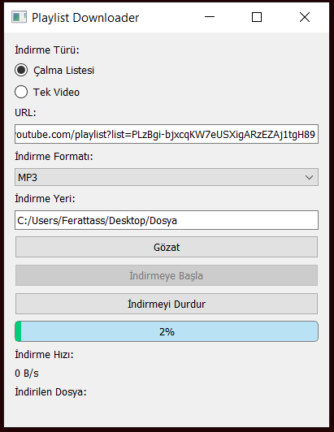

# Playlist Downloader



Playlist Downloader, YouTube'dan çalma listesi veya tek video indirmenize olanak sağlayan basit bir PyQt5 uygulamasıdır.

## Özellikler

- YouTube çalma listelerini veya tek videoları indirebilme
- İndirme formatı olarak MP4 veya MP3 seçebilme
- İndirilen dosyaları belirtilen bir klasöre kaydedebilme
- İndirme ilerlemesini, hızını ve indirilen dosyanın adını canlı olarak takip edebilme
- İndirme işlemini durdurabilme ve yeniden başlatabilme

## Kurulum

1. Bu projeyi GitHub'dan indirin veya klonlayın.

2. Gerekli Python paketlerini yüklemek için aşağıdaki komutu kullanın:

   ```shell
   pip install -r requirements.txt
## Nasıl Kullanılır

1. Uygulamayı çalıştırmak için aşağıdaki komutu kullanın:
     ```shell
     python playlist_downloader.py

2. Uygulama başlatıldığında, indirme türünü (çalma listesi veya tek video), YouTube URL'sini, indirme formatını (MP4 veya MP3), ve indirme yeri klasörünü seçin.

3. "İndirmeye Başla" düğmesine tıklayarak indirmeyi başlatın.

4. İndirme ilerlemesi, hızı ve indirilen dosyanın adı uygulama ekranında görüntülenecektir.

5. İndirmeyi durdurmak için "İndirmeyi Durdur" düğmesine tıklayın.
